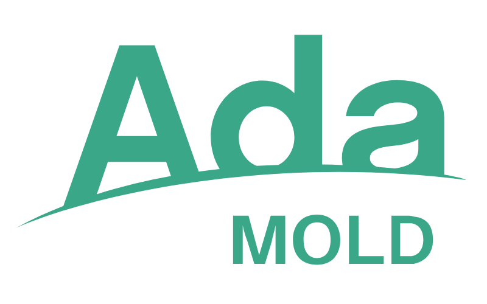

{ .alice align=right .off-glb }

# WELCOME TO MOLD

Mold &nbsp;&nbsp;&nbsp; Meta-variable Operations for Lean Development

---

Mold is a powerful tool that facilitates the creation and management of
project templates through customizable files with meta-variables. It allows
users to prepare a set of files and define placeholders (meta-variables) using
double curly braces that can be replaced with specific values when creating
new projects.

While Mold brings its own unique approach, several common features and
functionalities can be found in similar existing tools for project templating
and scaffolding.
