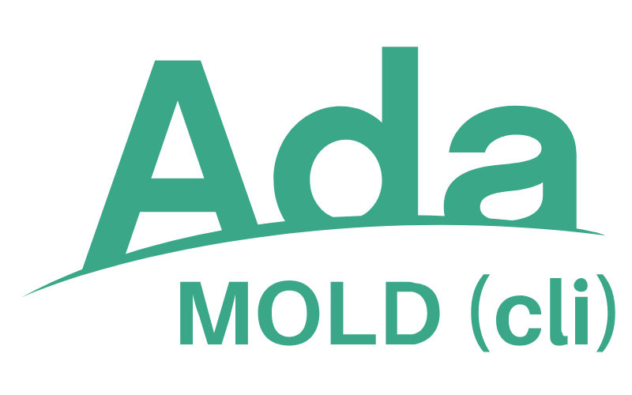
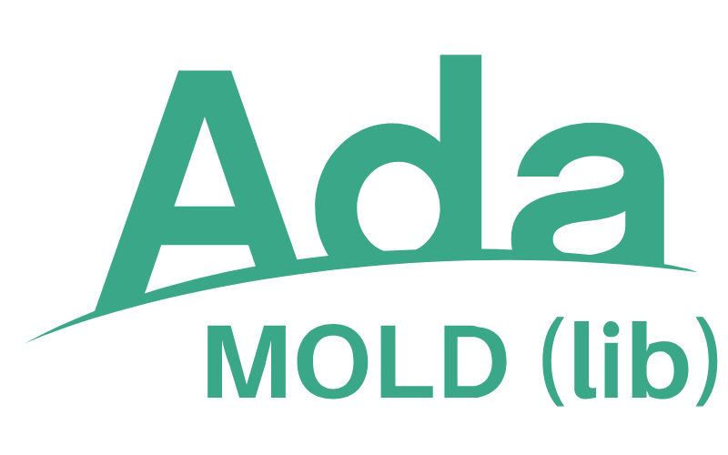

# USER GUIDE

---

[{ .alice-half align=right .off-glb }](https://github.com/rocher/mold)
## Command Line Tool

### Running mold

Run `mold` to get more information on mold commands and common options.

```txt title="mold"
mold 1.0.3 (lib-2.2.1)

USAGE
   mold [global options] <command> [command options] [<arguments>]

   mold help [<command>|<topic>]

ARGUMENTS
    <command>     Command to execute
    <arguments>   List of arguments for the command

GLOBAL OPTIONS
   -h (--help)     Display command help
   --no-color      Disable color
   --no-tty        Disable control characters
   -v (--verbose)  Show command activity

COMMANDS
   General
   help        Shows help on the given command/topic

   Process
   apply       Apply variable substitution to a file or directory
```

#### Apply

The main mold command is `apply`. Run `mold apply -h` to get more information:

```txt title="mold apply -h"
SUMMARY
   Apply variable substitution to a file or directory

USAGE
   mold apply [options] DEFINITIONS PATH [ OUTPUT_DIRECTORY ]

OPTIONS
   -f (--no-filenames)         No variable substitution in filenames
   -v (--no-variables)         No variable substitution in variables
   -d (--delete-sources)       Delete source files
   -o (--no-overwrite)         Do not overwrite destination files
   -s (--no-settings)          Disable defined settings
   -u (--on-undefined=ACTION)  Action on undefined: ignore, empty, [error]

GLOBAL OPTIONS
   -h (--help)     Display command help
   --no-color      Disable color
   --no-tty        Disable control characters
   -v (--verbose)  Show command activity

DESCRIPTION
   Apply variable substitution process to a file or directory. It requires a
   definitions file and a path, either a file or directory

   DEFINITIONS file is a TOML file with variables defined like 'foo="bar"'.
   Multiline variables are supported. See https://toml.io for more information.
   Definitions file can also contain mold settings that are applied when
   enabled.

   PATH is either a mold file or directory. When a directory is used, the
   variable substitution process is applied to all mold files, recursively in
   all subdirectories. Mold files must have the 'mold' extension. Generated
   files by the process have the same name removing the 'mold' extension.
   Variable substitution process is applied also to filenames.

   Please visit https://rocher.github.io/mold for a complete reference.

```

---

[{ .alice-half align=right .off-glb }](https://github.com/rocher/mold_lib)
## Ada Library

The Ada interface of `mold_lib` is quite simple. It consists of a unique
public package with only one function.

All the following descriptions are in the context of the `Mold_Lib` package:

```ada title="mold_lib.ads"
   package Mold_Lib is

      --  type definitions and function declaration

   end Mold_Lib;
```

### Apply

The only function call available is:

```ada title="mold.ads"
   function Apply
   (
      Source     : String          := ".";
      Output_Dir : String          := "";
      Toml_File  : String          := "mold.toml";
      Settings   : Settings_Access := null;
      Filters    : Filter_Access   := null;
      Results    : Results_Access  := null;
      Log_Level  : Log.Levels      := Log.Info;
   )
   return Boolean;
```

  1. `Source` is a filename or directory name.

  2. `Output_Dir` is a directory name used when `Source` is a filename to
     create the output file in a different directory.

  3. `Toml_File` is the filename that contains the variables definition.

  4. `Settings` is a pointer to a `Mold.Settings_Type` object. If `null`, the
     default settings are used. See section below for a complete description.

  5. `Filters` is an array `(0..9)` of pointers to functions with the
     signature
     ```ada
        function (S : String) return String;
     ```
     See [Custom Text Filters](reference-guide.md#custom-text-filters) for
     more  information.

  6. `Results` is a pointer to a `Results_Type` object. If not `null`, a
     report of all mold activity will be filled.

  6. Return value is `True` when the process finishes successfully.


### Settings

The `Settings_Type` is defined as:

```ada title="mold.ads"
   type Undefined_Behaviors is (None, Empty, Error);

   type Settings_Type is record
      Replacement_In_Filenames    : aliased Boolean;
      Replacement_In_Variables    : aliased Boolean;
      Delete_Source_Files         : aliased Boolean;
      Overwrite_Destination_Files : aliased Boolean;
      Enable_Defined_Settings     : aliased Boolean;
      On_Undefined                : aliased On_Undefined_Handling;
   end record;
```

If you specify a `null` pointer in the `Settings` parameter, then the default
settings are used, which are defined as:

```ada title="mold_lib.ads"
   Default_Settings : aliased Settings_Type :=
   (
      Replacement_In_Filenames    => True,
      Replacement_In_Variables    => True,
      Delete_Source_Files         => False,
      Overwrite_Destination_Files => True,
      Enable_Defined_Settings     => True,
      On_Undefined                => Error
   );
```

Refer to [Settings](reference-guide.md#settings) section for more information.


### Results

If you give a pointer to a `Results_Type` object as parameter in the `Apply`
function, detailed results are provided:

```ada title="mold_lib.ads"
   type Field_Type is
   (
      Files_Processed,
      Files_Renamed,
      Files_Overwritten,
      Files_Deleted,
      Variables_Defined,     --  in the toml file
      Variables_Found,       --  in all mold files
      Variables_Undefined,
      Variables_Replaced,
      Variables_Ignored,
      Variables_Emptied,
      Warnings
   );

   type Results_Type is array (Field_Type) of Natural;
```
